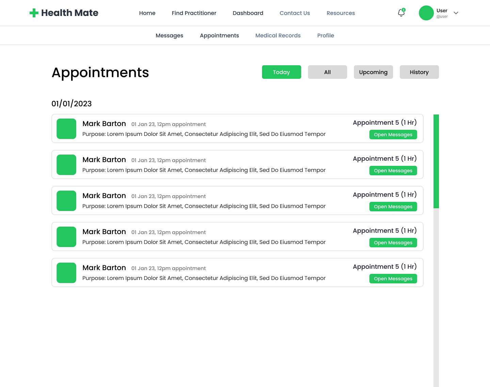
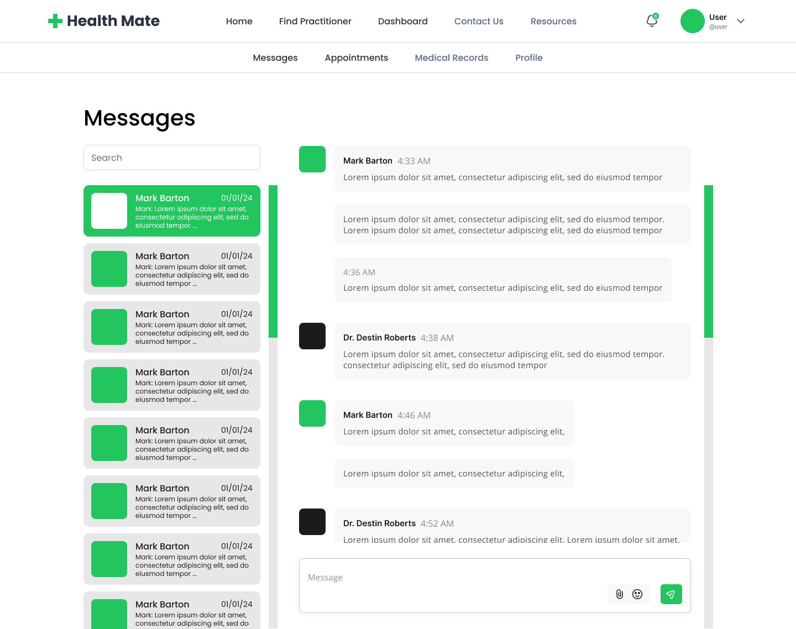

# HealthMate - Comprehensive Health Management Platform

HealthMate is designed as a comprehensive health management platform, aiming to streamline patient-practitioner interactions, appointment scheduling, medical records management, and more. The repository is divided into two primary sections: the client and the server, each with its own Dockerfile for containerization, facilitating deployment in various environments.

Youtube Video: https://youtu.be/dp5zZOwjSbM

## Deployment

Deployment is streamlined using Docker Compose, which orchestrates multi-container Docker applications for both development and production environments. This simplifies launching the client-server architecture of HealthMate.

### Local Development with Docker:

1. Ensure Docker and Docker Compose are installed on your machine.
2. Clone the repository and cd into the project directory.
3. Create a `.env` file in the root directory, similar to `.env.dev`, with necessary environment variables.
4. Execute `docker-compose up --build` to construct and start both the client and server containers.
5. The client will be accessible at http://localhost:3000, and the server at http://localhost:8000.

### Local Development without Docker:

1. Install Node.js and Python locally.
2. Clone the repo and navigate to the client directory.
3. Create a `.env` file in the root directory, similar to `.env.dev`, with necessary environment variables.
4. Run `npm install` to fetch client dependencies.
5. Initiate the client development server with `npm run dev`.
6. In a new terminal, go to the server directory and set up a Python virtual environment.
7. Install server dependencies with `pip install -r requirements.txt`.
8. Start the Django server using `python manage.py runserver`.
9. Access the client at http://localhost:3000 and the server at http://localhost:8000.

### Deployment Link:

The HealthMate application is deployed on Hetzner and Railway servers, available at https://cm3070.sgcreative.pro/.

Login credentials:

- Doctor account: username - doctor, password - pass@123
- Patient account: username - patient, password - pass@123

## Client

Built using Next.js, the client side emphasizes modern web development techniques, housed within the **client** directory. Key features include:

- UI React components and custom hooks for state management (**client/src/components**).
- Pages for rendering the UI, incorporating authentication, dashboard functionalities, and scheduling (**client/src/app**).
- ESLint, Prettier, Jest (testing), and Tailwind CSS configuration for an optimized development environment.
- A **public** folder for static assets like images and icons.

## Server

The server side utilizes Django to promote rapid development with a clean, pragmatic approach. Located under the **server** directory, it features:

- Data models for the core functionalities like appointments, conversation, medical_record, notifications and user profiles (**server/\*/\*/models.py**).
- Views for handling endpoint logic (**server/\*/\*/views.py**).
- Serializers for data conversion and URL configurations for request routing (**server/\*/\*/urls.py**).
- A Dockerfile for server containerization.

## Testing

Comprehensive tests in both the client and server directories ensure the reliability of HealthMate. The client uses **jest.config.ts** for configuration, while the server employs Django's testing framework for robust coverage.
